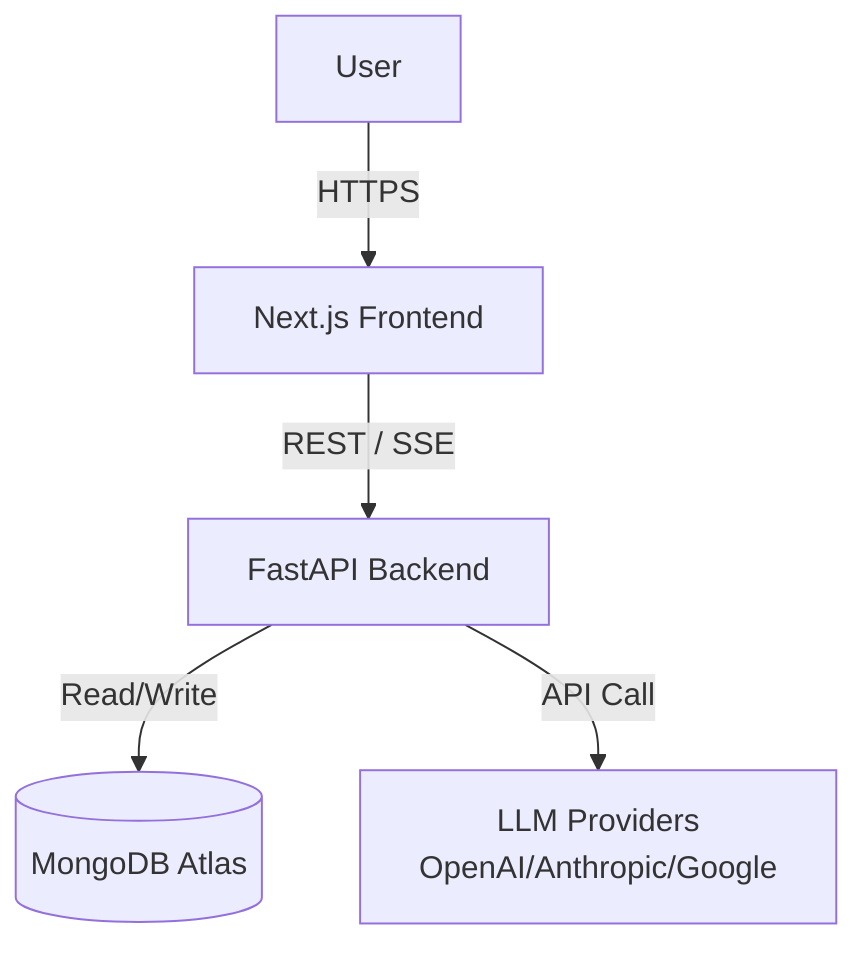
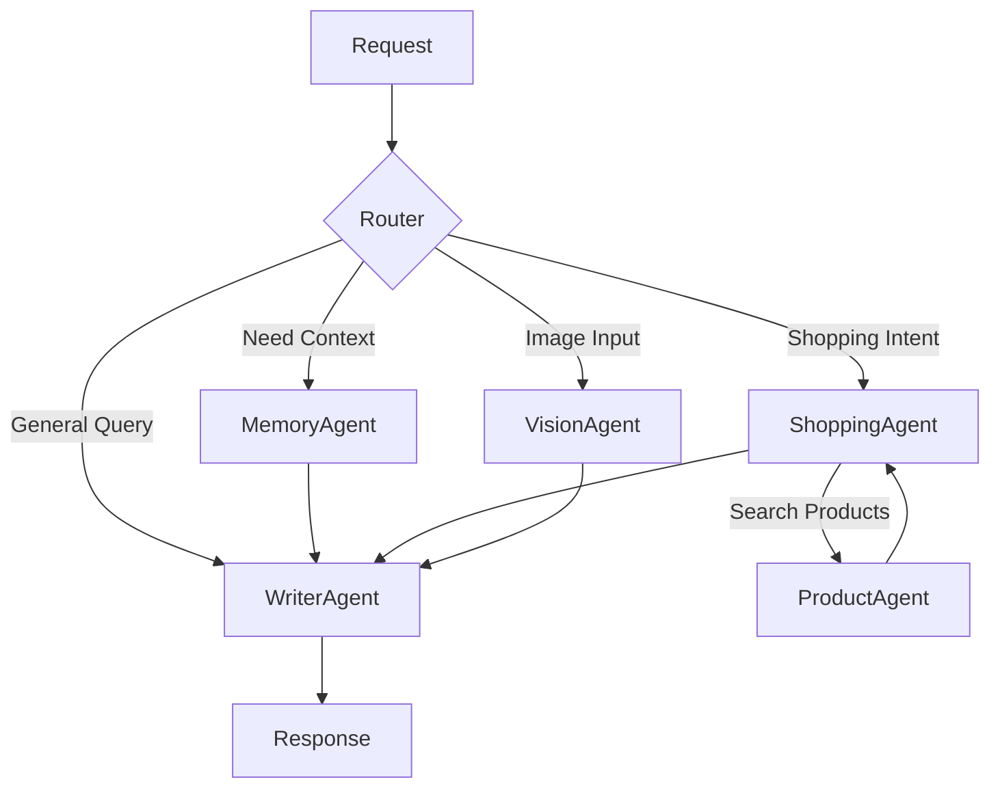

# System Architecture

The LLM Platform is designed as a modular, event-driven system enabling complex multi-agent interactions.

## High-Level Overview

The system consists of two main components:
- **Frontend**: A Next.js application handling user interaction and state.
- **Backend**: A FastAPI service orchestrating agents, memory, and LLM providers.

## Layered Architecture

The backend follows a clean architecture pattern:

1.  **API Layer (`app/api`)**: Handles HTTP requests, websocket/SSE connections, and input validation.
2.  **Orchestration Layer (`app/agents`)**: Uses LangGraph to coordinate multiple specialized agents.
3.  **Service Layer (`app/services`)**: Contains core business logic (Memory, Query processing).
4.  **Repository Layer (`app/db/repositories`)**: Abstracts database access.
5.  **Provider Layer (`app/providers`)**: Standardizes interfaces for different LLM APIs.

## Multi-Agent System (LangGraph)

The core intelligent behavior is driven by a graph of specialized agents:

### Agent Roles

-   **CoordinatorAgent**: entry point, classifies intent and routes to sub-agents.
-   **MemoryAgent**: Retrieves relevant conversation history using Vector Search.
-   **ShoppingAgent**: Handles multi-turn interviews to understand user preferences for products.
-   **ProductAgent**: Interfaces with search APIs (SerpAPI) to find real-time product data.
-   **VisionAgent**: Analyzes uploaded images.
-   **WriterAgent**: Synthesizes all gathered information into a final user-facing response.

## Data Flow & RAG

### Vector Search (Retrieval Augmented Generation)

1.  **Ingestion**: User queries and responses are embedded using OpenAI's `text-embedding-3-small` (1536 dims).
2.  **Storage**: Embeddings are stored in the `queries` collection in MongoDB, and setup vertor search index on MongoDB Atlas.
3.  **Retrieval**: The `MemoryAgent` performs a cosine similarity search to find semantically relevant past interactions.

### Request Flow

1.  User sends query via `POST /api/v1/query/stream`.
2.  **Coordinator** analyzes intent.
3.  **MemoryService** fetches relevant context.
4.  Appropriate agents execute tools (e.g., product search).
5.  **LLM** generates a response based on context + tool outputs.
6.  Response is streamed back to client via **Server-Sent Events (SSE)**.
7.  Interaction is saved to MongoDB for future memory.
